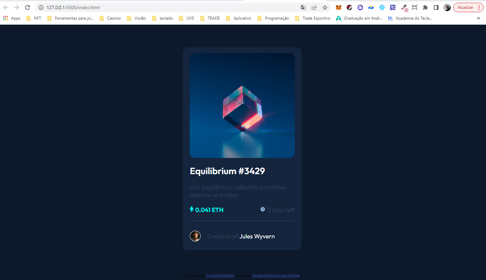

# Frontend Mentor - solução de componente de cartão de visualização NFT

Esta é uma solução para o [desafio do componente de cartão de visualização NFT no Frontend Mentor](https://www.frontendmentor.io/challenges/nft-preview-card-component-SbdUL_w0U). Os desafios do Frontend Mentor ajudam você a melhorar suas habilidades de codificação criando projetos realistas.

## Índice

- [Visão geral](#visão-geral)
  - [O desafio](#the-challenge)
  - [Captura de tela](#captura-de-tela)
  - [Links](#links)
- [Meu processo](#meu-processo)
  - [Construído com](#construído-com)
  - [O que aprendi](#o-que-aprendi)
  - [Desenvolvimento contínuo](#desenvolvimento-contínuo)
- [Autor](#autor)
- [Agradecimentos](#agradecimentos)


## Visão geral

### O desafio

Os usuários devem ser capazes de:

- Visualizar o layout ideal dependendo do tamanho da tela do dispositivo
- Veja os estados de foco para elementos interativos

### Captura de tela




### Links

- URL da solução: [Github](https://github.com/guhmonarin/nft-preview-card-component-main)
- URL do site ao vivo: [Vercel](https://nft-preview-card-component-main-olive.vercel.app/)

## Meu processo

### Construído com

- HTML5 
- CSS
- Flexbox

### O que eu aprendi

Neste exercício consegui entender e melhorar o uso de pseudo-classes, principalmente o uso do 'before' para colocar icones antes do texto.

``` css
.container__autor::before {
    content:'';
    background-image: url(./images/image-avatar.png);
    background-size: 100%;
    background-repeat: no-repeat;
    border: 1px solid var(--White);
    border-radius: 50%;
    height: 30px;
    width: 30px;
    position: relative;
    top: 9px;
    display: inline-block;
    margin-right: 20px;
}
```


### Desenvolvimento contínuo

Continuo melhorando o meu desempenho no uso do flexbox, e usar design responsivos para o site funcionar em vários tipos de tela. 

## Autor

- Linkedin - [Gustavo Monarin](https://www.linkedin.com/in/gustavo-monarin-652672127/)
- Github - [Gustavo Monarin](https://github.com/guhmonarin)
